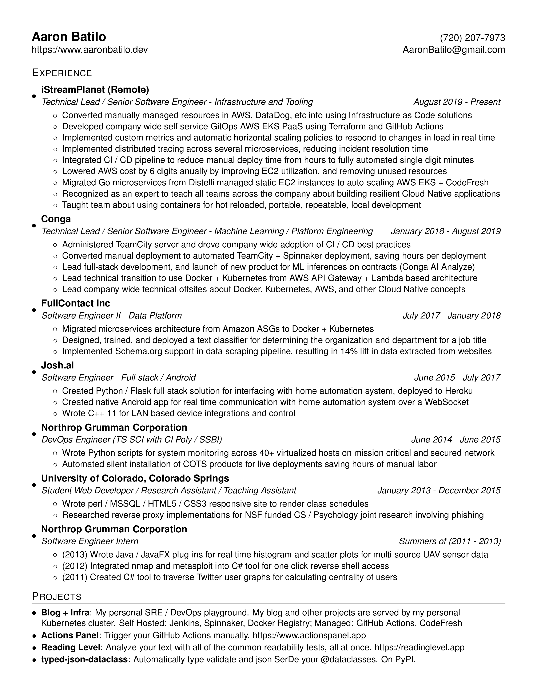

# resume
This repository has a CI pipeline setup for it which ensures that you can always find my
most up to date version of my resume [here](https://www.aaronbatilo.dev/resume)
I wanted to learn how to use LaTeX and resumes seem to be the easiest thing to
use it for.

My resume template is heavily based on
[this](https://github.com/sb2nov/resume).

## To update
For ease of generating new resumes, I created a small Dockerfile which contains
all the dependencies needed for converting the .tex file into a pdf, and then
convert the pdf to a png for the preview below.

Along with the Dockerfile, I created a Makefile which has the commands for
using the built Dockerfile.

Just type:
```
make png
```
This will build the Docker image, build the pdf, and build the png all at once.

## Preview

